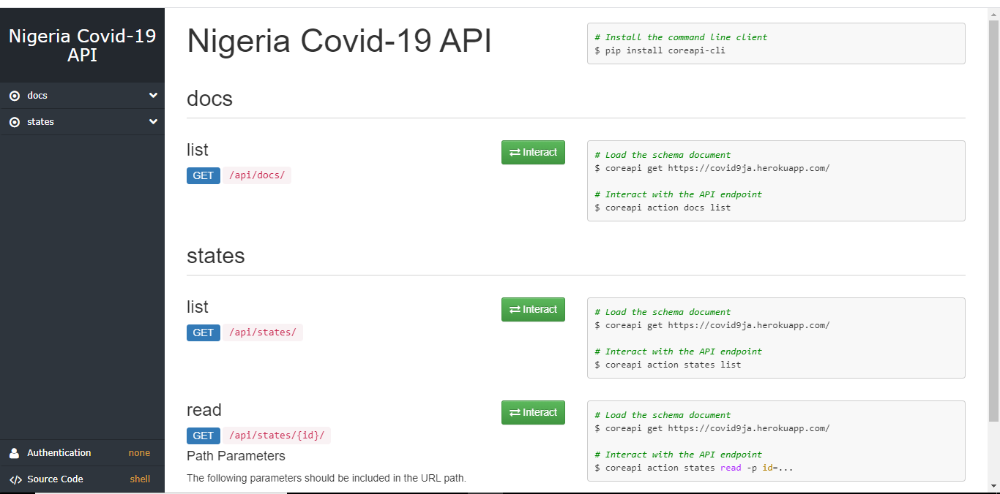
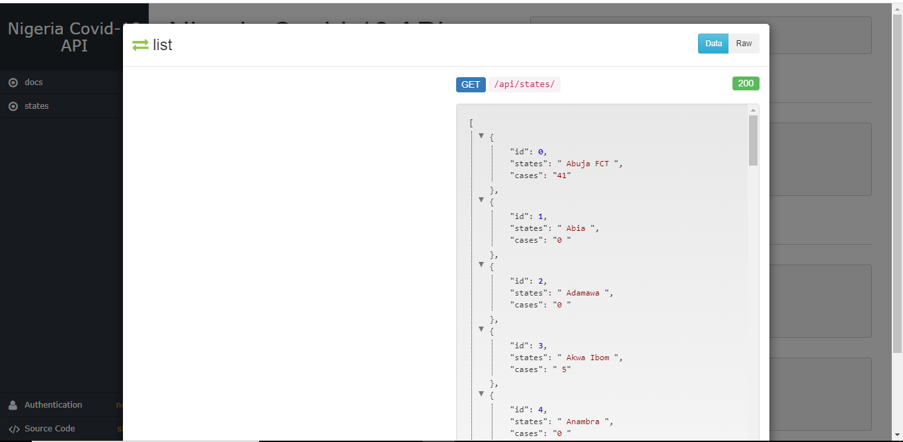
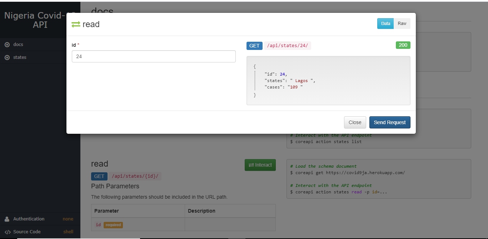
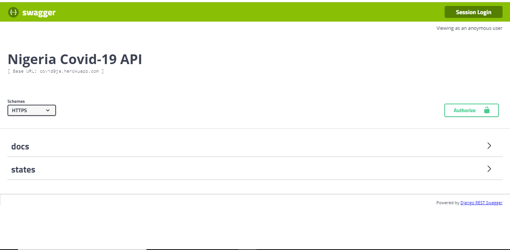
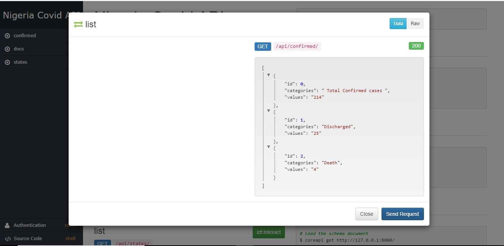

# covid9ja api

Get Nigeria Covid-19 states by states


[](https://github.com/Mastersam07/ncovid-19-api/graphs/contributors)

[](https://github.com/Mastersam07/ncovid-19-api/blob/master/LICENSE)

> This api is live
>> Serving data from NCDC(Nigeria Center For Disease Control) as a JSON API


## Demo
Check the `live API` <a href="https://covid9ja.herokuapp.com/"> here</a>
<br>
<a href="https://covid9ja.herokuapp.com/">Live API</a>
<br>

## 💻 Requirements
* Any Operating System (ie. MacOS X, Linux, Windows)
* Any IDE with python installed on your system(ie. Pycharm, VSCode etc)
* A little knowledge of Python, Django and Web scrapping
* Hands to code 🤓
* A brain to think 🤓

## ✨ Features
- [x] Nigeria states and cases
- [x] Nigeria total cases
- [x] Nigeria daily cases


## Dependencies
* [Django](https://flutter.dev/)
* [Django Rest Framework](https://www.django-rest-framework.org/)
* [PostgreSql](https://www.postgresql.org/)

## Getting started

#### 1. [Setting up PostgreSql](https://www.postgresql.org/)

#### 2. Clone the repo

```sh
$ git clone https://github.com/Mastersam07/ncovid-19-api.git
$ cd ncovid-19-api
```

#### 3. [Setup a virtual environment](https://programwithus.com/learn-to-code/Pip-and-virtualenv-on-Windows/)

#### 4. Get requirements

```sh
$ pip install requirements.txt
```

#### 5. Get the data

```sh
$ cd data_getter
$ python scraper.py
```

#### 6. Migrate database
 
```sh
$ cd ..\api
$ python manage.py migrate
```

#### 7. Run the application

```sh
$ python manage.py runserver
```

#### 8. Run the application in deployment(debug: false)

* ##### Create the folder "static" in the project root directory
* ##### Add the below bit of code to settings.py

```sh
STATIC_ROOT = os.path.join(BASE_DIR, 'staticfiles')
# Extra places for collectstatic to find static files.
STATICFILES_DIRS = (
    os.path.join(BASE_DIR, 'static'),
)
```
* ##### Run the below command in your terminal
```sh
$ python manage.py collectstatic
```
* ##### Your project is now production ready

## 📸 ScreenShots

|||
|||
||


## 🐛 Bugs/Request
#### Encounter any problem(s)? feel free to open an issue. If you feel you could make something better, please raise a ticket on Github and I'll look into it. Pull request are also welcome.

## ⭐️ License
#### <a href="https://github.com/Mastersam07/ncovid-19-api/blob/master/LICENSE">MIT LICENSE</a>
##### Transitively from NCDC Site, the data may not be used for commercial purposes.
## 🤓 Developer(s)
**Abada Samuel Oghenero**
